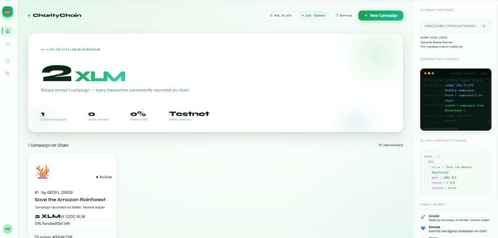

# 💝 CharityChain — Blockchain Charity Donation Tracker

> A fully decentralized charity donation platform built on the **Stellar blockchain** using **Soroban smart contracts**. Every campaign, donation, and claim is a real on-chain transaction — no middlemen, no hidden fees, zero trust required.

---

## 📸 Screenshot



---

## 🌐 Live Demo

| Item | Link |
|---|---|
| 🔗 **Smart Contract** | [View on Stellar Expert](https://stellar.expert/explorer/testnet/contract/CBNOEZI2KQW2LT3PMYQLULE73YQ2RQMTMQNBQ5OJFYGUM2YGZ33QXXX6) |
| 🔍 **Contract ID** | `CBNOEZI2KQW2LT3PMYQLULE73YQ2RQMTMQNBQ5OJFYGUM2YGZ33QXXX6` |
| 🌐 **Network** | Stellar Testnet |

---

## 🛠️ Tech Stack

### Blockchain
| Technology | Role |
|---|---|
| **Stellar Network** | The blockchain platform |
| **Soroban SDK v25.3.1** | Smart contract framework |
| **Rust (2021 edition)** | Smart contract language |
| **WebAssembly (WASM)** | Contract compilation target |
| **Stellar CLI v25.2.0** | Build, deploy & invoke tool |

### Frontend
| Technology | Role |
|---|---|
| **React 18 + TypeScript** | UI framework |
| **Vite** | Build tool & dev server |
| **@stellar/stellar-sdk** | Blockchain integration (sign & submit txs) |
| **lucide-react** | Icon library |

### Design
| Resource | Usage |
|---|---|
| **Syne** | Display headings |
| **Bricolage Grotesque** | Body text |
| **Inter** | UI labels & buttons |
| **JetBrains Mono** | Terminal & contract addresses |

---

## ✨ Features

- ✅ **Create campaigns** — deployed as real Soroban transactions on Stellar Testnet
- ✅ **Donate** — donations permanently recorded on the blockchain ledger
- ✅ **Claim funds** — creator signs a claim transaction once goal is reached
- ✅ **Live terminal** — real-time RPC console showing ledger events
- ✅ **Contract storage explorer** — reads live data directly from the blockchain
- ✅ **Transaction links** — every action links to stellar.expert block explorer
- ✅ **Zero platform fees** — the contract is the law, no company in the middle

---

## 📁 Project Structure

```
charity-donation-tracker/
│
├── contracts/
│   ├── hello-world/              ← Original template contract
│   └── charity-tracker/          ← REAL charity tracker contract
│       ├── Cargo.toml
│       └── src/lib.rs            ← Rust smart contract (6 functions)
│
├── frontend/
│   ├── src/
│   │   ├── App.tsx               ← Main React dashboard
│   │   ├── stellar.ts            ← Blockchain service layer
│   │   └── index.css             ← Premium light-green UI
│   ├── package.json
│   └── vite.config.ts
│
└── Cargo.toml                    ← Rust workspace
```

---

## 🔧 Smart Contract Functions

```rust
// Create a new fundraising campaign
create_campaign(creator, title, goal, duration_ledgers) -> u32

// Record a donation on-chain
donate(campaign_id, amount)

// Creator claims funds after goal is reached
claim(campaign_id)

// Read a single campaign
get_campaign(campaign_id) -> Campaign

// Get total campaigns count
get_count() -> u32

// Fetch all campaigns
get_all() -> Vec<Campaign>
```

---

## 🚀 Getting Started

### Prerequisites
- [Rust](https://rustup.rs/) + `wasm32v1-none` target
- [Stellar CLI](https://developers.stellar.org/docs/tools/developer-tools/cli/stellar-cli)
- [Node.js 18+](https://nodejs.org/)

### 1. Clone the repo
```bash
git clone https://github.com/soumik7484-art/Charity-donation-tracker-stellar.git
cd Charity-donation-tracker-stellar
```

### 2. Build the smart contract
```bash
stellar contract build
```

### 3. Deploy to Testnet
```bash
# Create a funded testnet account
stellar keys generate alice --network testnet --fund

# Deploy the contract
stellar contract deploy \
  --wasm target/wasm32v1-none/release/charity_tracker.wasm \
  --source-account alice \
  --network testnet
```

### 4. Update Contract ID
Copy the deployed contract ID and update `frontend/src/stellar.ts`:
```typescript
export let CONTRACT_ID = 'YOUR_CONTRACT_ID_HERE'
```

### 5. Run the frontend
```bash
cd frontend
npm install
npm run dev
```

Open **http://localhost:5173** 🎉

---

## 🏗️ Architecture

```
Browser (React + TypeScript)
        │
        ▼
  stellar.ts  ← Signs transactions with Stellar keypair
        │
        ▼
@stellar/stellar-sdk
        │
        ▼
Stellar Testnet RPC
(soroban-testnet.stellar.org)
        │
        ▼
Soroban Smart Contract (Rust/WASM)
        │
        ▼
Stellar Blockchain Ledger
(Permanent · Immutable · Public)
```

---

## 💡 Why CharityChain?

| Traditional Charity Platforms | CharityChain |
|---|---|
| You must **trust the company** | Smart contract **enforces rules in code** |
| **5–8% platform fees** | **0% fees** |
| Data can be **manipulated** | Blockchain records are **immutable** |
| Company can **shut you down** | Lives on blockchain **forever** |
| Donations can be **faked** | Every tx is **publicly verifiable** |

> *"Traditional charity platforms ask you to trust them. CharityChain makes trust unnecessary — the code is the contract."*

---

## 📊 Key Metrics

| Metric | Value |
|---|---|
| Contract size | 5,665 bytes |
| Avg transaction time | ~6 seconds |
| Platform fee | **0%** |
| Network fee per tx | ~0.00216 XLM (~$0.00003) |
| Smart contract functions | 6 |
| Blockchain | Stellar Testnet |

---

## 👨‍💻 Built With ❤️ on Stellar

Built as a demonstration of **Soroban smart contracts** on the **Stellar network** — bringing full transparency and decentralization to charitable giving.

---

## 📜 License

MIT License — free to use, modify and build upon.
