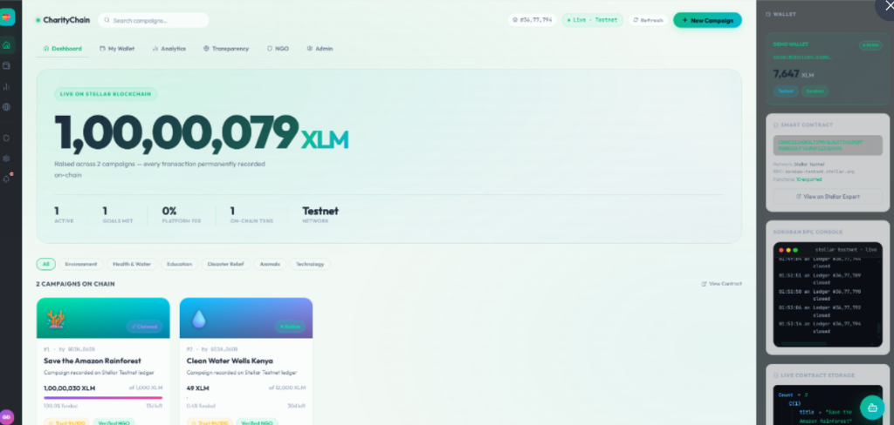
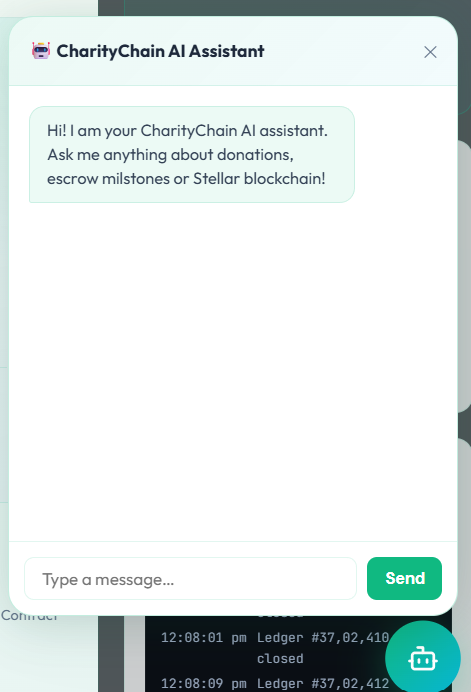

# 💝 GiveChain — Blockchain Charity Donation Tracker

<p align="center">
  
  
  
  
  
  
</p>

<p align="center">
  <b>A production-quality transparent charity platform built on the Stellar network using Soroban smart contracts, IPFS storage (Pinata), Vercel Serverless, and Groq Llama-3.3 AI.</b>
</p>

---

### 📸 Application Previews

<p align="center">
  <b>Dashboard Interface</b>
  <br/>
  
  <br/><br/>
  <b>AI Assistant & Chatbot</b>
  <br/>
  
</p>

---

### 🌟 Introduction
GiveChain transforms traditional charity donation trackers into a fully transparent, verifiable milestone-based platform. Operating directly on-chain on the Stellar network using WebAssembly Soroban smart contracts, GiveChain ensures that donation funds remain locked in escrow, releasing only when the creator uploads cryptographic proof of spend (stored on IPFS) and it receives admin validation.

---

## 🔗 Live Deployments

| Resource | URL |
| :--- | :--- |
| 🚀 **Live Production App** | [Click here to view Live Site](https://soumik7484-art.github.io/Charity-donation-tracker-stellar/) |
| 🤖 **Serverless Backend API** | [Click here to view API Info](https://backend-two-gamma-80.vercel.app/api/info) |
| 🔗 **Smart Contract Explorer** | [View CDLC5DAK...3NRP on Stellar Expert](https://stellar.expert/explorer/testnet/contract/CDLC5DAK7FOCAO77IWMZHA3UG5HLEZ2DEDGGFSMCRCJ5XXOEJC4P3NRP) |
| 🌐 **Target Network** | Stellar Testnet (RPC: `soroban-testnet.stellar.org`) |

---

## ✨ Upgraded Hackathon Features

* 🔒 **Milestone-Based Escrow Fund Release** — Campaigns consist of custom milestones (e.g. 40%, 30%, 30%). Funds remain locked in contract escrow. Releasing funds transfers only that milestone's allocated amount, not the full balance.
* 📦 **IPFS Proof-of-Spend Gallery** — Creator uploads a receipt/photo per milestone before releasing funds. The IPFS CID is stored on-chain against that milestone. The frontend Proof Gallery features direct links to Pinata & public IPFS gateways.
* ↩️ **Tracked Donations & Refund Mechanism** — Connects campaign ledger deadlines and targets. Tracks individual contributions on-chain: if the deadline passes and the goal is not met, donors can claim their exact contribution back.
* ✅ **Charity Verification Badge** — Admin-controlled creator allowlist mapping. Creator campaigns created by a verified address display a "✅ Verified Charity" badge.
* 🛡️ **Owner Wallet-Gated Admin Panel** — A secure panel for the contract owner to approve/revoke verification status for campaign creators.
* 📊 **Donor Dashboard ("My Donations")** — A dashboard page showing campaign donation records, milestone proof releases, and refund eligibility indicators.
* 🤖 **AI Assistant Chatbot** — Powered by Groq's **Llama-3.3-70b-versatile** model to help donors audit milestones.
* 📄 **Downloadable PDF Receipts** — Automatically generates clean donation receipts using `jsPDF`.

---

## 🛠️ Technology Stack

### Smart Contract Layer
* **Soroban SDK v25.3.1**: Smart contract framework.
* **Rust (2021 edition)**: Safe, fast language for contract logic.
* **WebAssembly (WASM)**: Compilation target for high-performance execution.

### Frontend Layer
* **React 18 + TypeScript**: Dynamic UI layout.
* **Vite**: Ultra-fast hot module reloading & build tool.
* **@stellar/stellar-sdk**: Wallet signing and RPC query integration.
* **Pinata IPFS SDK**: IPFS file pinning and gateway helper.
* **jsPDF & html2canvas**: High-fidelity PDF receipt rendering.

### Backend & AI Layer
* **Express.js (Node)**: Middleware API for AI processing.
* **Vercel Serverless**: Serverless backend hosting.
* **Groq SDK**: Connection client to the Llama-3.3-70b model.

---

## 🔧 Smart Contract API

```rust
// Initialize global contract admin
init(admin: Address)

// Create a new fundraising campaign (badge verified if creator allowlisted)
create_campaign(creator: Address, admin: Address, title: String, goal: i128, duration_ledgers: u32) -> u32

// Record a donation on-chain with donor address mapping for refund eligibility
donate_tracked(campaign_id: u32, donor: Address, amount: i128)

// Submit IPFS Proof CID (only creator can submit for pending milestone)
submit_proof(campaign_id: u32, milestone_index: u32, creator: Address, cid: String)

// Admin approves a milestone (unlocks milestone funds)
approve_milestone(campaign_id: u32, milestone_index: u32)

// Creator claims the funds for an approved milestone
claim_milestone(campaign_id: u32, milestone_index: u32)

// Claim refund (returns full XLM contribution if campaign expired + goal unmet)
claim_refund(campaign_id: u32, donor: Address) -> i128

// Add verified creator to allowlist (only global admin can call)
add_verified_creator(admin: Address, creator: Address)
```

---

## 📁 Project Architecture

```
charity-donation-tracker/
│
├── contracts/
│   └── charity-tracker/          ← Soroban smart contract source code
│       ├── Cargo.toml
│       └── src/lib.rs            ← Upgraded Rust Smart Contract Logic
│
├── backend/
│   ├── server.js                 ← Express Router (Vercel Serverless Function)
│   ├── db.js                     ← Temporary database fallback handler
│   └── vercel.json               ← Deployment config
│
└── frontend/
    ├── src/
    │   ├── App.tsx               ← Main React application
    │   ├── stellar.ts            ← Stellar/Freighter wallet connection layer
    │   ├── ipfs.ts               ← Pinata IPFS integration client
    │   ├── components/
    │   │   ├── MilestoneTracker.tsx  ← Vertical timeline milestone releases
    │   │   ├── ProofGallery.tsx      ← IPFS spent receipts view
    │   │   ├── RefundBanner.tsx      ← Expired campaign refund banner
    │   │   ├── DonorDashboard.tsx    ← "My Donations" statistics
    │   │   └── AdminPanel.tsx        ← Admin creators allowlist manager
    │   └── DonationReceipt.tsx   ← jsPDF template layout
    └── package.json
```

---

## 🚀 Getting Started

### 1. Configure Pinata IPFS Keys
Add your Pinata API keys to `/frontend/.env.local`:
```env
VITE_PINATA_API_KEY=7a29580fb935e683de77
VITE_PINATA_API_SECRET=<your_secret_api_key>
VITE_PINATA_JWT=<your_jwt_token>
```

### 2. Build and Deploy Contract
```bash
# Compile WASM target
stellar contract build

# Deploy to Stellar Testnet
stellar contract deploy \
  --wasm target/wasm32v1-none/release/charity_tracker.wasm \
  --source SBAE77WAY5ZVM3IRAS3SM7I44R565EWRZV3NKP5QXI6XWCWQTDSDXJBZ \
  --network testnet
```

### 3. Initialize Contract
```bash
stellar contract invoke \
  --id CDLC5DAK7FOCAO77IWMZHA3UG5HLEZ2DEDGGFSMCRCJ5XXOEJC4P3NRP \
  --source-account SBAE77WAY5ZVM3IRAS3SM7I44R565EWRZV3NKP5QXI6XWCWQTDSDXJBZ \
  --network testnet \
  -- init --admin SBAE77WAY5ZVM3IRAS3SM7I44R565EWRZV3NKP5QXI6XWCWQTDSDXJBZ
```

### 4. Run Frontend Client
```bash
cd frontend
npm install
npm run dev
```

---

## 📜 License
This project is licensed under the MIT License - feel free to build upon it!
